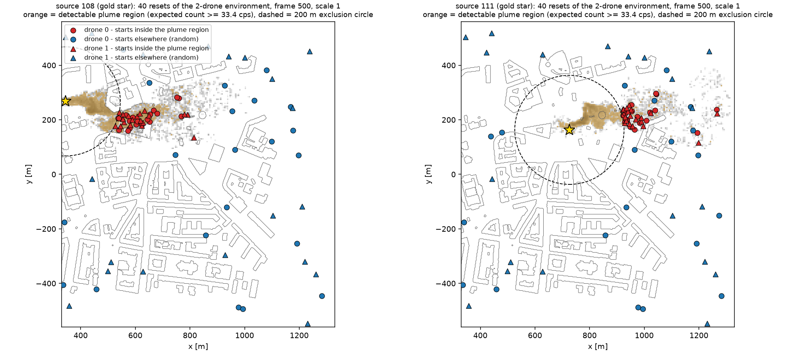
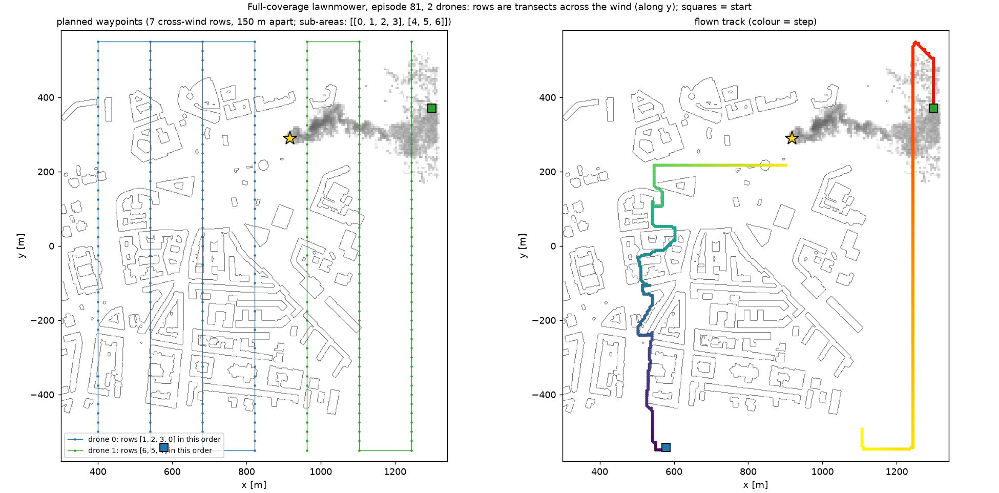
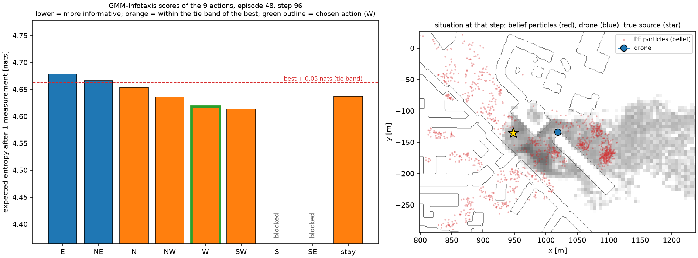
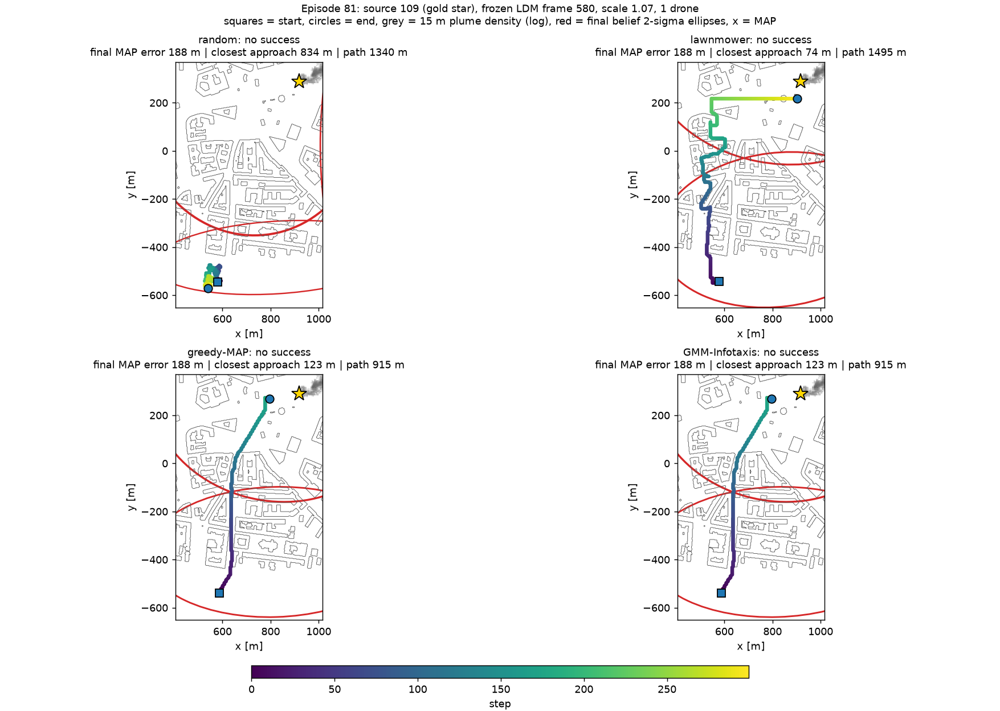
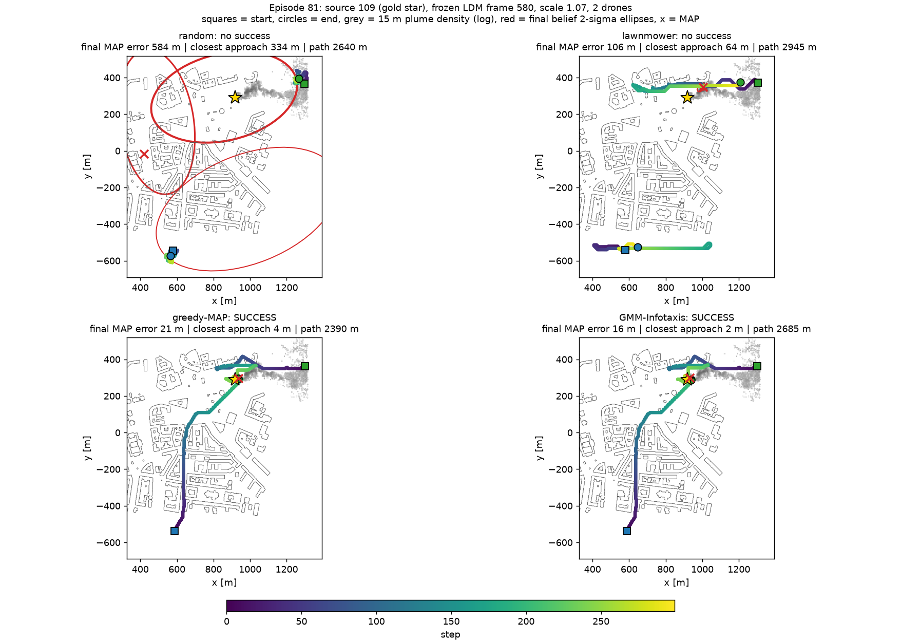

# 드론 초기 위치와 베이스라인 4종의 움직임 (쉬운 설명서)

작성일 2026-10-01 (2026-10-02 개정: lawnmower를 영역 전체 훑기로 교체, Infotaxis 동률 폭 민감도 반영) · 대상: D9-4 예비 배치 `t2_4_v2`(13 소스 × 소스당 10 에피소드 × 드론 1·2대, 에피소드마다 300스텝 전체 실행), lawnmower 재실행 `t2_4_lawn_v2`, Infotaxis 동률 폭 비교 `ifx_tol*`, 병합 요약 `t2_4_v3` · 코드: `srcloc_env/env/source_env.py`, `srcloc_env/env/multi_agent.py`, `srcloc_env/baselines/policies.py`, `srcloc_env/baselines/planning.py` · 이 문서의 수치는 배치 로그에서 계산한 값이며, 그림은 `docs/figures/`에 있습니다(`scripts/fig_baseline_explainer.py`로 재생성).

---

## 0. 먼저 읽을 요약

1. **드론 시작 위치**는 에피소드 시드로 결정됩니다. 1대와 2대 실험은 **같은 시드**를 쓰므로 **드론 0의 시작점은 1대·2대에서 똑같고**, 2대일 때만 드론 1이 **독립적으로 한 번 더** 추첨됩니다(드론 0과 10 m 이상 떨어지게).
2. 각 드론의 시작점은 "소스에서 200 m 이상 떨어진, 건물 밖 자유 위치"입니다. 그중 **절반 확률로 농도가 검출될 만한 플룸 영역 안**에서, 나머지는 영역 제한 없이 임의로 뽑습니다.
3. 2대는 두 드론이 **각자 독립적으로** 플룸 안에서 시작할 기회를 가지므로, **둘 중 하나라도 플룸 안에서 시작하는 비율(65 %)이 1대(33 %)보다 높습니다.** 따라서 "2대가 1대보다 잘한다"에는 **협력 효과와 시작 운이 섞여 있습니다**(2.4절).
4. **random**은 막히지 않은 행동 중 무작위, **lawnmower**는 센서·belief를 전혀 쓰지 않고 **영역 전체를 줄 단위로 훑는 왕복 경로**(2대는 영역을 두 구역으로 나눠 각자 구역)만 따라가고, **greedy-MAP**은 belief의 최고 확률 덩어리 평균으로 건물을 피해 곧장 가고, **GMM-Infotaxis**는 "다음 측정 한 번으로 belief가 가장 많이 좁혀질 행동"을 고릅니다.
5. **결과 요약**(관측 가능 12 소스 120 에피소드, 주 성공률): 1대 GMM-Infotaxis 9.2 % · greedy-MAP 6.7 % · lawnmower(영역 전체) 5.8 % · random 0 %, 2대 15.8 / 13.3 / 10.8 / 0 %. 순서는 지켜지지만 **방법 간 차이는 신뢰구간 안**입니다. 바람 방향 줄로 훑는 lawnmower 변형(1대 12.5 %)은 정보 기반 방법과 같거나 더 높습니다(3.6절).
6. 구현을 점검하며 확인된 **한계**: (a) 영역 전체 lawnmower는 300스텝(1.5 km)으로는 영역의 일부만 훑고, 플룸 안에서 시작하면 곧바로 줄 끝으로 떠나 오히려 못 찾습니다(3.2절). (b) GMM-Infotaxis는 한 스텝 앞의 정보 점수 차이가 약 0.01 nats로 작아, 동률 폭 0.05 nats에서 **98 %의 결정에서 모든 행동이 동률**이 되어 belief 최고 지점 쪽 행동이 선택됩니다. 동률 폭은 알고리즘 정의의 일부이며 현 상태로 유지합니다(사용자 결정 2026-10-02). 폭을 0으로 줄이면 잡음 때문에 성공률이 낮아집니다(3.4절).

---

## 1. 에피소드 한 번의 공통 흐름

모든 방법은 **같은 환경**(`SourceLocEnv`/`MultiDroneEnv`)에서 움직이므로, 같은 센서·같은 입자필터(PF)·같은 성공 판정을 씁니다. 방법마다 다른 것은 "다음 행동을 고르는 규칙" 하나뿐입니다.

| 순서 | 일어나는 일 | 설명 |
|---|---|---|
| ① | 행동 선택 | 드론마다 9개 행동 중 하나: 8방향(동·북동·북·북서·서·남서·남·남동) 5 m 이동 또는 정지. 건물(지붕 13 m 이상 + 2 m 여유)이나 영역 밖으로 가는 행동은 **막힘**이고, 막힌 행동을 고르면 **그 자리에 정지**합니다. |
| ② | 이동 | 드론은 스텝마다 최대 5 m(1 스텝 = 1 s이므로 5 m/s, 시간 해석 A 가정). 고도는 15 m 고정. |
| ③ | 측정 | 이동한 위치에서 농도 카운트 y 1개(소스 1개의 플룸만 측정; 배경 20 cps 포함, 평균 (k0·scale·농도 + 20)·1 s). |
| ④ | belief 갱신 | 모든 드론의 측정이 **하나의 PF**에 순서대로(드론 0 → 드론 1) 들어갑니다. PF는 "소스가 어디일지"의 확률분포(입자 2,000개)입니다. |
| ⑤ | 요약 | PF를 타원 3개(GMM)로 요약합니다. 상위 타원의 크기 σ와 지도 추정(MAP) 오차로 성공을 판정합니다(주 기준 σ < 30 m & 오차 < 50 m). |

> 정책이 보는 정보: **random**은 허용 행동 목록만, **lawnmower**는 자기 위치·스텝 번호·건물 지도만(측정값과 belief는 안 봄), **greedy-MAP**은 belief의 최상위 타원 평균과 건물 지도, **GMM-Infotaxis**는 belief 전체(입자·κ 격자)와 전방모델입니다. 어떤 방법도 진실 소스 위치는 모릅니다(검증용 oracle만 예외, 3.5절).

---

## 2. 드론 초기 위치

### 2.1 에피소드 설정이 먼저 고정됩니다

배치는 `eval/episodes.py`가 만든 **공통 에피소드 목록**(`episodes.csv`)의 각 줄마다 환경을 `reset(seed=…)`합니다. 한 줄에는 소스, 확산장 프레임(400~599 중 하나), 센서 스케일(0.3~3), **시드**가 들어 있고, 같은 줄을 모든 방법·드론 수가 공유합니다. 시드가 같으면 reset은 항상 같은 결과를 냅니다(결정성 테스트 확인).

### 2.2 드론 한 대의 시작점을 뽑는 방법 (`_sample_start`)

1. **주사위**: 확률 0.5로 "플룸 시작", 나머지는 "임의 시작"으로 정합니다(`ENV_START_PLUME_FRAC = 0.5`).
2. **플룸 시작**이면: 그 에피소드의 소스 농도 슬랩(15 m 고도, 5 m 격자)에서 **기대 카운트 ≥ 33.4 cps**인 셀(= 배경보다 확실히 높게 검출될 셀)을 모읍니다. 그중 **소스에서 200 m 이상**이고 PF 사전 상자(x 330~1315 m, |y| ≤ 550 m) 안인 셀을 하나 무작위로 골라 셀 안에서 위치를 조금 흩뜨리고, **건물 밖(자유 위치)**이면 확정합니다. 조건에 맞는 셀이 없으면(약한 소스·작은 scale) "임의 시작"으로 대체합니다.
3. **임의 시작**이면: 사전 상자 안에서 위치를 무작위로 뽑아 **소스에서 200 m 이상 + 건물 밖**인 첫 후보를 씁니다.

그림 1은 같은 에피소드 설정에서 시드만 바꿔 **2대 환경을 40번 reset**한 결과입니다. 주황색이 플룸 영역, 빨간 표시가 플룸 안에서 시작한 드론, 파란 표시가 임의 위치입니다.

### 2.3 드론이 2대일 때 (`MultiDroneEnv.reset`)

1. **드론 0**: 1대 환경과 **완전히 같은 방법·같은 난수**로 뽑습니다(그래서 같은 시드의 1대·2대 에피소드에서 드론 0의 출발점이 같습니다 — 테스트로 확인).
2. **드론 1**: 위 2.2의 절차를 **한 번 더, 독립적으로** 실행합니다. 즉 드론 1도 0.5 확률로 플룸 시작, 아니면 임의 시작입니다. 결과가 **드론 0과 10 m 미만이면 버리고 다시** 뽑습니다(최대 50번).
3. 에피소드의 `start_type`(plume/random)은 **드론 0 기준**으로 기록됩니다.

**이 배치(130 에피소드)에서 실제로 나온 시작점을 재현해 센 값**입니다(`starts.csv`):

| 항목 | 값 |
|---|---|
| 드론 0이 플룸 영역 안에서 시작 | 33 % (43/130) |
| 드론 1이 플룸 영역 안에서 시작 | 42 % |
| 둘 다 플룸 안 / 둘 다 밖 | 11 % / 35 % |
| **둘 중 하나라도 플룸 안** | **65 %** |
| 소스까지 거리(전체 드론) | 중앙값 377 m (하위 10 % 220 m, 상위 10 % 792 m) |
| 두 드론 사이 거리 | 중앙값 471 m (하위 10 % 101 m, 최소 15 m) |
| 임의 시작점의 위치 | 25 %가 동쪽 개활지(x > 1115 m, 상자 폭의 약 20 %), 26 %가 \|y\| > 400 m — 건물 구역은 비행금지 셀이라 개활지가 약간 더 자주 뽑힙니다 |

(플룸 영역의 기준은 에피소드의 프레임·scale마다 달라서 같은 소스라도 영역 크기가 다릅니다. 소스 110은 영역이 거의 없어 대부분 임의 시작입니다.)

### 2.4 이 방식이 만드는 효과와 주의 (1대 vs 2대 비교)

두 드론이 **독립적으로** 플룸 시작 기회를 가지므로, **2대 팀은 1대보다 "첫 단서"를 일찍 얻을 확률이 높습니다.** 배치에서 관측 가능 12개 소스만 모아, 2대 에피소드를 "플룸 안에서 시작한 드론 수"로 나누어 성공률(주 기준)을 보면 다음과 같습니다.

| 방법 | 2대: 둘 다 밖 (n=38) | 2대: 한 대 안 (n=68) | 2대: 둘 다 안 (n=14) | 2대 전체 | 1대: 드론 0이 밖에서 시작 | 1대: 드론 0이 안에서 시작 | 1대 전체 |
|---|---|---|---|---|---|---|---|
| random | 0/38 (0 %) | 0/68 (0 %) | 0/14 (0 %) | 0/120 (0 %) | 0/78 (0 %) | 0/42 (0 %) | 0/120 (0 %) |
| lawnmower | 6/38 (16 %) | 6/68 (9 %) | 1/14 (7 %) | 13/120 (11 %) | 7/78 (9 %) | 0/42 (0 %) | 7/120 (6 %) |
| greedy-MAP | 2/38 (5 %) | 13/68 (19 %) | 1/14 (7 %) | 16/120 (13 %) | 2/78 (3 %) | 6/42 (14 %) | 8/120 (7 %) |
| GMM-Infotaxis | 2/38 (5 %) | 16/68 (24 %) | 1/14 (7 %) | 19/120 (16 %) | 4/78 (5 %) | 7/42 (17 %) | 11/120 (9 %) |

- 읽는 법: 같은 방법이라도 **플룸에서 시작한 드론이 있느냐**에 따라 성공률이 크게 달라집니다. 2대 팀의 성공률 상승에는 (a) **공유 belief로 인한 협력**(한 드론이 단서를 얻으면 다른 드론도 그 쪽으로 감, 그림 3)과 (b) **시작 운**(둘 중 하나가 플룸 안에서 시작할 확률이 65 % 대 33 %)이 **함께** 들어 있고, 현재 배치로는 둘을 분리할 수 없습니다.
- **시작 조건을 맞춰 보면**(random 제외 세 방법): 1대에서 드론 0이 밖에서 시작한 성공률은 3~9 %, 2대에서 둘 다 밖은 5~16 %입니다. 1대에서 플룸 시작은 0~17 %, 2대에서 한 대가 플룸 시작은 9~24 %입니다. 표본이 작아(칸당 n = 14~78) 결론은 아니지만, **2대의 성공률 상승은 시작 조건 차이가 상당 부분을 설명하는 것으로 보입니다.** (사용자 결정 2026-10-01: 2대 시작 규칙은 현재 방식을 유지하고 층별 보고로 관리합니다.)
- 표 2·논문의 "2대가 1대보다 빠르다(T3-3)"를 주장하려면 이 혼동을 정리해야 합니다 — 해결 선택지는 5절 ①.

---

## 3. 베이스라인 4종이 움직이는 방식

| | random | lawnmower | greedy-MAP | GMM-Infotaxis |
|---|---|---|---|---|
| 한 줄 설명 | 갈 수 있는 곳 중 아무 데나 | 영역 전체를 줄 단위로 훑기 | belief 최고 확률 지점으로 곧장 | 다음 측정이 belief를 가장 좁혀 줄 방향 |
| 측정값·belief를 쓰나 | 안 씀 | **안 씀** | belief 요약만 | belief 전체 + 전방모델 |
| 건물 | 막힌 행동 제외 | 막힌 경로점 건너뜀 + 측지 최단 경로로 우회 | **측지 최단 자유 경로**(건물 우회) | 막힌 행동 제외, 동률 시 측지 경로 |
| 2대 협력 | 없음 | **영역을 두 구역으로 나눠** 각자 자기 구역만 훑음 | 두 드론이 **같은 목표**로 | **순차 탐욕**(드론 0 → 가상 갱신 → 드론 1) |
| 에피소드 벽시계(300스텝) | 7 s | 9 s | 6 s | 32 s (1대) / 68 s (2대) |

### 3.1 random — 갈 수 있는 곳 중 아무 데나

- **매 스텝**: 드론마다 "막히지 않은 행동"(정지 포함) 중 **균등한 확률로** 하나를 고릅니다. 센서·belief·목표 없음.
- **2대**: 두 드론이 서로 모르고 각자 무작위로 움직입니다.
- **성질**: 이동 방향이 계속 바뀌어 한 곳 근처를 맴돕니다 — 1대 130 에피소드의 중앙값으로 300스텝 동안 **1320 m를 움직이지만 출발점에서 직선거리로는 51 m만** 벗어납니다. 플룸에서 시작하지 않으면 플룸을 만나기 어렵습니다. **"아무 지능 없이 얻는 성공률"의 기준선**입니다.
- 코드: `RandomPolicy`.

### 3.2 lawnmower — 영역 전체를 줄 단위로 훑기 (2026-10-02 개정)

**왜 바꿨나**: 이전 버전은 드론의 시작 y 주변 100 m 띠 하나만 훑었습니다(부록 3.2.1). 사용자 결정으로 **영역 전체를 훑는 방식**으로 바꾸고, **2대는 영역을 나눠** 훑도록 했습니다(`baselines/coverage.py`, `LawnmowerPolicy`).

**경로를 만드는 법**
1. **훑을 영역** = PF 사전 상자 전체(x 330~1315 m, |y| ≤ 550 m).
2. **줄(row) 방향 = 바람에 수직**(y 방향 가로지르기 줄), **간격 150 m**(config `LAWN_ROW_SPACING_M`) → 줄 7개(x ≈ 400, 541, 682, 822, 963, 1104, 1245 m). 근거: 검출 가능한 플룸 영역은 **풍하(x)로 길고(중앙값 230 m, 하위 25 % 160 m) 폭(y)이 좁아(중앙값 20 m)**, 바람에 수직인 줄을 160 m 안쪽 간격으로 깔면 대부분의 플룸을 가로지릅니다. 바람 방향 줄로 같은 보장을 얻으려면 20~50 m 간격이 필요해 300스텝 안에서는 불가능합니다.
3. **경로점**: 줄 위에 25 m 간격(`LAWN_WP_SPACING_M`), 건물 안(비행금지) 경로점은 제거.
4. **한 대일 때 순서**: 드론에서 **가장 가까운 줄**부터 시작해, 줄이 더 많이 남은 쪽으로 진행하고 마지막에 건너뛴 쪽 줄로 돌아옵니다. 줄에는 **가까운 끝**에서 들어가 반대 끝까지 훑고, 다음 줄은 **반대 방향**으로 훑습니다(왕복 = boustrophedon).
5. **두 대일 때(영역 분할)**: 줄 7개를 **연속된 두 구역**(4줄 + 3줄: 서쪽 구역 x < 892 m, 동쪽 구역)으로 나눠, **출발 위치에 가까운 구역을 각 드론에 배정**(두 배정 중 초기 이동이 짧은 쪽)합니다. 각 드론은 자기 구역의 줄만 4번과 같은 규칙으로 훑습니다.

**매 스텝 하는 일**: 현재 목표 경로점을 향해 **건물을 우회하는 최단 경로**(greedy-MAP과 같은 `GeodesicField`)로 5 m씩 이동하고, **목표 경로점 10 m 이내에 들어오면 다음 경로점**으로 넘어갑니다(경로점 번호가 스텝 번호와 묶여 있던 이전 버전의 "뒤처짐"이 없음). 측정값과 belief는 보지 않으며, 구역을 모두 훑으면 정지합니다.

그림 4는 에피소드 81번(2대)입니다. 왼쪽이 계획(파랑 = 드론 0의 서쪽 구역 줄 4개, 초록 = 드론 1의 동쪽 구역 줄 3개), 오른쪽이 실제로 날아간 경로입니다. 1대 예시는 `figures/lawnmower_plan_vs_track_one_drone.png`입니다.

**결과와 한계(실측)**
1. **300스텝으로는 영역의 일부만 훑습니다.** 줄 하나가 1,100 m(220스텝)이고 시작점에서 첫 줄까지도 이동해야 하므로, 1대는 줄 1.4개, 2대는 줄 2~3개를 지납니다. 관측 가능 12 소스 120 에피소드에서 주 성공률은 **1대 5.8 % [3, 12], 2대 10.8 % [6, 18]**(엄격 1.7 % / 2.5 %)입니다.
2. **플룸 안에서 시작하면 오히려 못 찾습니다**(1대 plume 시작 성공 0 %): 시작점에서 가장 가까운 줄의 가까운 끝(수백 m 떨어진 y 끝)으로 먼저 이동하므로 곧바로 플룸을 떠나고, 줄이 플룸을 가로지르는 순간은 몇 스텝뿐이라 PF가 소스를 좁히지 못합니다. 아래 표는 1·2대에서 **"명확한 신호(카운트 > 100)를 한 번이라도 얻은 에피소드 비율 / 소스 최근접 거리 중앙값 / 100 m 이내 접근 비율"**입니다.

| 방법 | 드론 수 | plume 시작 | random 시작 |
|---|---|---|---|
| lawnmower (영역 전체, 바람에 수직) | 1대 | 7 % / 228 m / 2 % | 13 % / 373 m / 14 % |
| lawnmower (영역 전체, 바람에 수직) | 2대 | 10 % / 183 m / 21 % | 21 % / 197 m / 29 % |
| lawnmower 변형: 바람 방향 줄 | 1대 | 48 % / 54 m / 83 % | 3 % / 341 m / 12 % |
| lawnmower 변형: 바람 방향 줄 | 2대 | 43 % / 56 m / 74 % | 12 % / 150 m / 38 % |
| lawnmower 이전 버전: 시작 y 띠 | 1대 | 38 % / 80 m / 60 % | 3 % / 334 m / 6 % |
| lawnmower 이전 버전: 시작 y 띠 | 2대 | 40 % / 75 m / 64 % | 26 % / 156 m / 36 % |

3. **바람 방향 줄 변형**(`lawnmower_alongwind`, 줄이 x 방향, 100 m 간격 11줄, 같은 규칙)은 플룸 안에서 시작하면 줄을 따라 플룸을 길게 지나므로 1대 plume 시작 성공이 31 %로 높고 전체 주 성공률도 **1대 12.5 % [8, 20], 2대 15.0 % [10, 22]**로 영역 전체(바람에 수직) 방식보다 높습니다. 즉 **탐색 효율(플룸을 가로지르는 횟수)과 추정 정확도(플룸을 따라 오래 측정)가 상충**합니다.
4. 어느 줄 방향을 표 2의 "lawnmower"로 쓸지는 **사용자 결정 사항**입니다(5절 ②). 이 문서의 기본은 설계 시점(결과를 보기 전)에 정한 **바람에 수직**이며, 바람 방향 변형은 참고 행으로 병기합니다.

#### 3.2.1 (부록) 이전 버전 lawnmower — 시작 y의 띠 하나

시작 y를 중심으로 100 m 폭 지그재그를 서쪽으로 진행하고 상자 끝에서 반대로 왕복하는 경로였고, 경로점 번호를 스텝 번호와 같게 두어 드론이 경로점을 따라잡지 못했습니다(실제 y 범위 중앙값 66 m, 속도 4.2 m/스텝). 시작 y의 띠 하나만 훑었습니다. 기록용으로 `lawnmower_band`로 보존했고(1대 7.5 % [4, 14], 2대 13.3 % [8, 21]), 계획과 실제 경로의 차이는 `figures/lawnmower_v1_band_plan_vs_track.png`에 있습니다.

### 3.3 greedy-MAP — belief 최고 지점으로 곧장

- **목표**: 공유 belief를 요약한 타원 3개 중 **가중치가 가장 큰 타원의 평균**(= "지금 가장 그럴듯한 소스 위치").
- **매 스텝**: 목표까지의 **건물을 피하는 최단 자유 경로**(`GeodesicField`: 4 m 격자 위 Dijkstra, 계산 약 39 ms)를 구하고, 막히지 않은 행동 중 **착지점의 "남은 경로 길이"가 가장 작은 행동**을 고릅니다. 목표 반경 2.5 m 안이면 정지합니다. 목표가 20 m 넘게 움직였을 때만 경로를 다시 계산합니다.
- **2대**: 두 드론이 **같은 목표**를 향합니다(역할 분담 없음) → 같은 곳으로 모여듭니다.
- **성질**: belief가 옳으면 빠르지만, **belief가 틀렸을 때 스스로 탐색하지 않고** 그 자리에서 측정을 반복해 belief를 더 굳힐 수 있습니다(확인 편향). 초기에는 belief가 넓어 목표가 상자 중앙 근처에서 흔들립니다. 건물 우회 경로를 쓰기 전 버전(유클리드 최근접 착지)은 71 %가 정지였고, 같은 방식의 oracle이 건물에 막혀 멈추는 것을 확인해 측지 경로로 바꿨습니다.
- 코드: `GreedyMapPolicy`, `baselines/planning.py`.

### 3.4 GMM-Infotaxis — "다음 측정으로 가장 많이 알게 될" 방향

**아이디어**: 지금 belief의 불확실성(엔트로피)이 H라면, 각 행동을 한 뒤 **측정을 한 번 하고 나면 belief가 얼마나 좁아질지**를 미리 계산해, 평균적으로 **엔트로피가 가장 작아지는 행동**을 고릅니다.

**매 스텝, 드론마다**(`GmmInfotaxisPolicy`):
1. **belief 표본**: PF 입자 중 가중치에 비례해 **500개**를 뽑아 "대표 입자"로 씁니다.
2. **가상의 측정 10개**: 대표 입자·κ(감도) 값을 무작위로 골라 "소스가 거기 있고 감도가 그만큼이라면 나올 카운트"를 10번 시뮬레이션합니다(PF와 같은 음이항 분포 사용). **같은 난수를 모든 행동에 공유**해 행동 간 점수 차이가 우연이 아니라 예측 차이만 반영하도록 합니다.
3. **행동 9개 평가**: 각 행동의 착지점에서 가상 측정 10개 **각각**을 받았다고 가정하고 belief(대표 입자 500개)를 갱신해 **엔트로피(20 m 셀 히스토그램, 보상에 쓰는 것과 같은 정의)**를 구한 뒤 10개를 평균합니다. 낮을수록 정보가 많은 행동입니다.
4. **선택**: 점수가 가장 낮은 행동. 단, **최저 점수와 0.05 nats 이내인 행동들은 동률**로 보고, 그중 **belief 최고 타원 평균으로 가는 건물 우회 경로를 가장 많이 줄이는 행동**(= greedy-MAP의 선택)을 고릅니다.
5. **2대(순차 탐욕)**: 드론 0이 행동을 고르면, 그 행동 위치에서 **기대 카운트를 받았다고 가정한 가상 갱신**을 belief 표본에 적용한 뒤, 그 갱신된 belief로 드론 1이 행동을 고릅니다(두 드론이 같은 정보를 중복해서 얻으려 하지 않게). 동률 해소는 두 드론 모두 같은 목표(최고 타원 평균)입니다.

그림 5는 예시 에피소드(48번, 1대)의 96번째 스텝입니다. 막대는 행동별 기대 엔트로피이고(낮을수록 좋음), 빨간 점선 아래 주황 막대 5개가 "동률 구간"입니다. 점수가 가장 낮은 것은 남서(SW)이지만 동률 구간 안에서 목표 방향인 서(W)가 선택됐습니다.

**동률 폭 민감도(1대, 같은 120 에피소드, 같은 시드)** — 폭 0.05 nats(기본), 0.005, 0(순수 Infotaxis)을 비교했습니다. 0.05 재실행은 원래 배치와 **130/130 에피소드에서 완전히 같은 결과**(결정성 확인)였습니다.

| 동률 폭 [nats] | 주 성공률 | 엄격 | plume · random 시작 성공 | 소스 최근접 거리 중앙값 (100 m 이내 비율) | 경로 중앙값 | 동률 해소 결정 비율 | **전 행동 동률** 결정 비율 |
|---|---|---|---|---|---|---|---|
| 0 | 3.3 % (4/120) | 0.8 % | 4/42 · 0/78 | 329 m (4 %) | 1312 m | 1 % | 1 % |
| 0.005 | 9.2 % (11/120) | 5.0 % | 6/42 · 5/78 | 212 m (18 %) | 1060 m | 98 % | 91 % |
| 0.05 | 9.2 % (11/120) | 5.8 % | 7/42 · 4/78 | 210 m (18 %) | 950 m | 100 % | 98 % |
| greedy-MAP (기준) | 6.7 % (8/120) | 5.0 % | 6/42 · 2/78 | 210 m (16 %) | 735 m | - | - |

- **0.05 → 98 % 결정이 "모든 허용 행동 동률"**: 이 결정들에서는 belief 최고 지점 쪽으로 가는 행동이 선택됩니다(성공률 9.2 %; 참고로 greedy-MAP 6.7 %).
- **0.005 → 91 %가 여전히 전 행동 동률**이고 성공률도 같습니다(9.2 %). 0.05와 최종 오차가 다른 에피소드는 37개뿐입니다.
- **0(순수 Infotaxis) → 3.3 %로 나빠집니다**: 점수가 가장 낮은 행동을 그대로 고르면 경로가 길어지고(1312 m) 소스에 가까이 가는 에피소드가 줄어듭니다(최근접 329 m).

**왜 그런가 — 점수 차이는 신호인가, 잡음인가**(`analyze_ifx_noise.py`: 실제 에피소드 4개의 12개 상태에서 독립 난수로 8번씩 점수를 다시 계산)

| 가상 측정 개수 S | 행동 간 평균 점수 차이 [nats] | 한 행동 점수의 잡음 sd [nats] | 차이/잡음 | 반복 간 같은 행동 선택 비율 | 반복 간 순위 상관 |
|---|---|---|---|---|---|
| 10 | 0.0097 | 0.0475 | 0.15 | 69 % | +0.62 |
| 40 | 0.0101 | 0.0297 | 0.17 | 94 % | +0.92 |
| 160 | 0.0088 | 0.0302 | 0.32 | 94 % | +0.95 |

- 행동 사이의 평균 점수 차이는 **약 0.01 nats**(전체 엔트로피 5~7 nats의 0.2 %)로 매우 작습니다. 5 m 이동은 다음 측정이 예측하는 카운트를 거의 바꾸지 못하기 때문입니다.
- 기본값 S = 10에서는 **같은 상태에서도 선택이 31 %의 반복에서 달라질 만큼 잡음이 큽니다**(0.69). 그래서 동률 폭 0이 나빠집니다.
- S를 40 이상으로 늘리면 순위는 안정되어 **같은 행동 선택 비율 94 %, 순위 상관 +0.92**가 됩니다 — 차이는 작지만 **신호가 있다**는 뜻입니다. 한 점수의 절대 잡음(sd 0.03 nats)은 줄지 않지만, 순위가 안정적이므로 이 흔들림은 대부분 모든 행동에 공통으로 더해지는 성분으로 판단됩니다.
- 결론: 현재 한 스텝 앞 Infotaxis는 **정보 차이가 너무 작아 greedy-MAP과 구분되지 않는 정책**입니다. 의미 있는 정보 기반 베이스라인이 필요하면 (i) 가상 측정 40개 이상 + 동률 폭 0.005 이하(계산 약 4배, 추정), (ii) 한 스텝(5 m)이 아니라 여러 스텝 앞(예: 25 m)을 보는 방식을 시험해야 합니다(5절 ③).

**기타 한계**: 한 스텝 앞만 보므로 신호가 없는 곳에서는 위처럼 동률이 되고, 계산 비용은 에피소드(300스텝)당 32 s(1대) / 68 s(2대)입니다.

### 3.5 (참고) oracle_loiter — 검증 전용, 경쟁 방법 아님

진실 정보를 써서 **플룸 정점**(소스 200 m 이내 15 m 농도의 평활 최대점)으로 건물을 우회해 가서 25 m 안에서 맴도는 정책입니다. "탐색 문제를 없앴을 때 환경·PF·성공 판정이 성공할 수 있는가"를 확인하는 상한용이며(이 배치 1대 기준 성공률 57 %, 엄격 기준 30 %), 표 2에는 회색 참고 행으로만 씁니다.

### 3.6 이번 배치의 성공률 한눈에 보기 (관측 가능 12 소스 × 10 에피소드 = 120, 주 기준 σ < 30 m & 오차 < 50 m)

| 방법 | 1대 성공률 [95 % CI] | 1대 엄격(15/20 m) | 1대 plume / random 시작 | 2대 성공률 [95 % CI] | 2대 엄격 | 2대 plume / random 시작 |
|---|---|---|---|---|---|---|
| random | 0.0 % [0, 3] | 0.0 % | 0 % / 0 % | 0.0 % [0, 3] | 0.0 % | 0 % / 0 % |
| lawnmower (영역 전체, 바람에 수직) | 5.8 % [3, 12] | 1.7 % | 0 % / 9 % | 10.8 % [6, 18] | 2.5 % | 5 % / 14 % |
| lawnmower 변형: 바람 방향 줄 | 12.5 % [8, 20] | 5.8 % | 31 % / 3 % | 15.0 % [10, 22] | 7.5 % | 19 % / 13 % |
| lawnmower 이전 버전: 시작 y 띠 | 7.5 % [4, 14] | 3.3 % | 17 % / 3 % | 13.3 % [8, 21] | 5.0 % | 19 % / 10 % |
| greedy-MAP | 6.7 % [3, 13] | 5.0 % | 14 % / 3 % | 13.3 % [8, 21] | 4.2 % | 14 % / 13 % |
| GMM-Infotaxis | 9.2 % [5, 16] | 5.8 % | 17 % / 5 % | 15.8 % [10, 23] | 10.0 % | 17 % / 15 % |
| (검증용) oracle | 57.5 % [49, 66] | 30.0 % | 60 % / 56 % | 65.8 % [57, 74] | 32.5 % | 64 % / 67 % |

- 방법 간 차이는 모두 **신뢰구간이 크게 겹칩니다**(표본 120). 순서 판정(G2)은 통과하지만 방법 간 우열의 근거로 쓰기에는 부족하며, 최종 평가(소스당 30 에피소드)에서 다시 봐야 합니다.
- **plume 시작과 random 시작이 크게 다릅니다.** 임의 시작에서는 어떤 방법도 플룸에 닿기 어렵습니다(탐색 능력의 시험).
- oracle(회색 참고)은 탐색을 없앴을 때 환경·PF·성공 판정이 성공 가능함을 보입니다(주 기준 약 60 %, 엄격 30 %).

---

## 4. 같은 에피소드에서 비교해 보기 (에피소드 81번: 소스 109, 프레임 580)

**1대**(그림 2): 드론은 남쪽 끝(x ≈ 580, y ≈ −540)에서 시작합니다. random은 그 자리 근처를 맴돌고, lawnmower는 시작점에서 가장 가까운 줄부터 바람에 수직인 줄(y 방향)을 차례로 훑으며(소스에 최대 74 m까지 접근하나 성공 판정 못 받음), greedy-MAP과 GMM-Infotaxis는 belief 쪽(북쪽)으로 올라가지만 123 m까지만 접근하고 실패합니다.

**2대**(그림 3): 드론 0은 같은 남쪽 끝에서, 드론 1은 **플룸 끝(x ≈ 1300, y ≈ 370)에서 시작**했습니다. 드론 1이 일찍 얻은 측정으로 공유 belief가 정확해지고, greedy-MAP과 GMM-Infotaxis에서는 **남쪽에서 출발한 드론 0도 그 belief를 따라 올라와** 두 드론 모두 소스에 2~10 m까지 접근하며 약 220~230스텝에 성공 판정을 받습니다. lawnmower는 줄을 4+3으로 나눠 훑지만 성공 판정을 받지 못하고(소스까지 가장 가까이 간 거리: 드론 0은 74 m, 드론 1은 326 m), random도 실패합니다. 이 예가 2.4절의 두 효과(시작 운 + 공유 belief)를 함께 보여 줍니다.

---

## 5. 한계와 남은 선택지

| # | 상태 | 내용 | 선택지 |
|---|---|---|---|
| ① | **결정됨(2026-10-01)** | 2대의 드론 1을 독립 추첨 → 둘 중 하나가 플룸 안에서 시작할 확률 65 % 대 1대 33 % | **현재 방식 유지**. 분석에서 "플룸 시작 드론 수"로 층별 보고(2.4절 표) |
| ② | **결정됨(2026-10-02)** | 표 2의 lawnmower는 **바람에 수직(영역 전체, 줄 150 m)** 방식으로 둔다. 바람 방향 줄 변형(1대 12.5 %)과 이전 버전은 기록·참고용으로만 보존 | 변경 없음 |
| ③ | **결정됨(2026-10-02)** | GMM-Infotaxis는 **현 상태(동률 폭 0.05 nats) 유지**. 민감도·잡음 분석 결과는 3.4절에 기록 | 변경 없음 |
| ④ | 유지 | greedy-MAP은 belief가 틀려도 그 자리에서 굳힘 | 의도된 성질로 두고 한계로 기술 |
| ⑤ | 유지 | 모든 방법의 성공률이 낮고 서로 신뢰구간이 겹침(표본 120) | 최종 평가(소스당 30 에피소드)에서 짝지은 비교로 재확인 |

---

## 6. 코드 위치

| 내용 | 파일 |
|---|---|
| 시작점 추첨(1대) | `srcloc_env/env/source_env.py` `_sample_start`, `reset` |
| 시작점 추첨(2대) | `srcloc_env/env/multi_agent.py` `reset` |
| 에피소드 목록·시드 | `srcloc_env/eval/episodes.py` |
| 4개 정책 + 변형 + oracle | `srcloc_env/baselines/policies.py` |
| 영역 전체 줄 경로(분할·순서) | `srcloc_env/baselines/coverage.py` |
| 건물 우회 최단 경로 | `srcloc_env/baselines/planning.py` |
| 이전 lawnmower(시작 y 띠) 경로점 | `srcloc_env/scripts/validate_pf_adjoint.py` `lawnmower_path` |
| Infotaxis 동률 폭·잡음 분석 | `srcloc_env/scripts/analyze_ifx_sensitivity.py`, `analyze_ifx_noise.py` |
| 평가 러너 | `srcloc_env/eval/run_eval.py` |
| 그림·시작점 통계 | `srcloc_env/scripts/fig_baseline_explainer.py` |
| 배치 산출물 | `F:\김도현박사님 자료\JH\cache\eval\`의 `t2_4_v2`(1차 배치: 시작점·스텝 로그), `t2_4_lawn_v2`(lawnmower 재실행), `ifx_tol0` · `ifx_tol0.005` · `ifx_tol0.05`(Infotaxis 동률 폭), `t2_4_v3`(병합 요약) |
